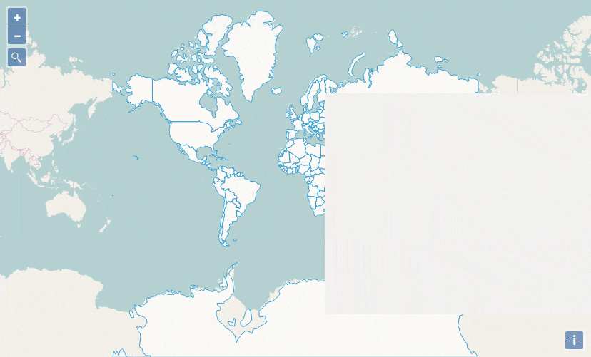

# OpenLayers Control for layer Search

It works with single layer and a column name (test with Openlayers 10.6.0)

We mainly borrowed code from [ol-geocoder](https://github.com/Dominique92/ol-geocoder) for the UI part.



## Demo

You can see the demo in action using [RawGit](https://andreaordonselli.github.io/ol-search-layer/examples/control-ol-search-layer.html)

## Dependency

You have to be aware that we use [horsey](https://github.com/bevacqua/horsey/), a "Progressive and customizable autocomplete component". This third party is Vanilla JavaScript (No jQuery or any other heavy framewok). It's a 12kB compressed and gzipped.

## How to use it

### For CSS link and JS script tags

```
<!-- Insert Horsey CSS link -->
<link rel="stylesheet" href="//cdnjs.cloudflare.com/ajax/libs/horsey/4.2.2/horsey.min.css">
<!-- Insert ol3-search-layer plugin CSS link -->
<link rel="stylesheet" href="../dist/ol-search-layer.css">
```

After the call to the ol.js script (or your custom build)

```
<!-- Insert Horsey JS script -->
<script src="//cdnjs.cloudflare.com/ajax/libs/horsey/4.2.2/horsey.min.js"></script>
<!-- Insert ol3-search-layer plugin JS script -->
<script src="../dist/ol-search-layer.min.js"></script>
```

If you need the file for a demo, you can reference them from below code (or you can download them)

```
<script src="//rawgit.com/andreaordonselli/ol-search-layer/master/dist/ol-search-layer.min.js"></script>
<link rel="stylesheet" href="//rawgit.com/andreaordonselli/ol-search-layer/master/dist/ol-search-layer.min.js">
```

### In your JS code

```
var searchLayer = new ol.SearchLayer({
  layer: layerImage,
  colName: 'name',
  zoom: 10,
  collapsed: true,
  map: map
});

map.addControl(searchLayer);
```

## License

MIT
